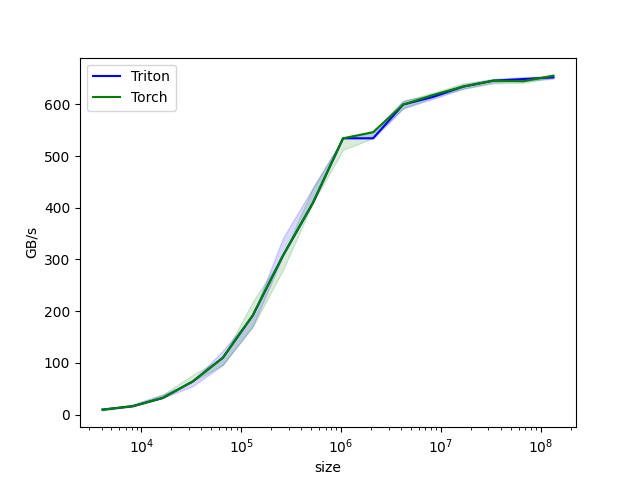

# Triton vector add

## Performance: GiB/s

```bash
python3 triton_vector_add.py
tensor([1.3713, 1.3076, 0.4940,  ..., 0.6724, 1.2141, 0.9733], device='cuda:0')
tensor([1.3713, 1.3076, 0.4940,  ..., 0.6724, 1.2141, 0.9733], device='cuda:0')
The maximum difference between torch and triton is 0.0
vector-add-performance:
           size      Triton       Torch
0        4096.0    9.600000    9.600000
1        8192.0   15.999999   15.999999
2       16384.0   31.999999   31.999999
3       32768.0   63.999998   63.999998
4       65536.0  127.999995  127.999995
5      131072.0  192.000000  192.000000
6      262144.0  307.200008  307.200008
7      524288.0  409.600010  409.600010
8     1048576.0  534.260858  534.260858
9     2097152.0  534.260858  546.133325
10    4194304.0  599.414644  599.414644
11    8388608.0  614.400016  618.264140
12   16777216.0  638.337688  634.219349
13   33554432.0  646.736871  645.674897
14   67108864.0  644.352325  646.205448
15  134217728.0  651.829264  658.377556
```

## Performance Plots 



## Dump gen code

```bash
export TRITON_CACHE_DIR=$(pwd)/cache
python3 triton_vector_add.py
# tree gen codes
cd cache && tree .
.
├── QLAEYTJR4KV5WSBGJKRUAKVP475DE47NW7P4XMI2RFXBOIE5TZ4Q
│   └── cuda_utils.so
├── ZARIVSGCNM2WWDVKCRVGVJENDT5COGJCEQYAY47GLLIBDH2FTW2A
│   ├── add_kernel.cubin
│   ├── add_kernel.json
│   ├── add_kernel.llir
│   ├── add_kernel.ptx
│   ├── add_kernel.ttgir
│   ├── add_kernel.ttir
│   └── __grp__add_kernel.json
└── ZQ5DTL26WSB4LIKU54SE5N3EGMWSTLNP3XSOKNNVT6YBZ3ECSBOA
    └── __triton_launcher.so
```

check the generated PTX codes:  

```ASM
//
// Generated by LLVM NVPTX Back-End
//

.version 8.4
.target sm_89
.address_size 64

	// .globl	add_kernel              // -- Begin function add_kernel
                                        // @add_kernel
.visible .entry add_kernel(
	.param .u64 .ptr .global .align 1 add_kernel_param_0,
	.param .u64 .ptr .global .align 1 add_kernel_param_1,
	.param .u64 .ptr .global .align 1 add_kernel_param_2,
	.param .u32 add_kernel_param_3,
	.param .u64 .ptr .global .align 1 add_kernel_param_4
)
.reqntid 128, 1, 1
{
	.reg .pred 	%p<7>;
	.reg .b32 	%r<33>;
	.reg .f32 	%f<25>;
	.reg .b64 	%rd<11>;
	.loc	1 32 0                          // triton_vector_add.py:32:0
$L__func_begin0:
	.loc	1 32 0                          // triton_vector_add.py:32:0

// %bb.0:
	ld.param.u64 	%rd7, [add_kernel_param_0];
	ld.param.u64 	%rd8, [add_kernel_param_1];
$L__tmp0:
	.loc	1 41 24                         // triton_vector_add.py:41:24
	mov.u32 	%r25, %ctaid.x;
	.loc	1 46 24                         // triton_vector_add.py:46:24
	shl.b32 	%r26, %r25, 10;
	ld.param.u64 	%rd9, [add_kernel_param_2];
	ld.param.u32 	%r27, [add_kernel_param_3];
	.loc	1 47 41                         // triton_vector_add.py:47:41
	mov.u32 	%r28, %tid.x;
	shl.b32 	%r29, %r28, 2;
	and.b32  	%r30, %r29, 508;
	.loc	1 47 28                         // triton_vector_add.py:47:28
	or.b32  	%r31, %r30, %r26;
	or.b32  	%r32, %r31, 512;
	.loc	1 49 21                         // triton_vector_add.py:49:21
	setp.lt.s32 	%p1, %r31, %r27;
	setp.lt.s32 	%p2, %r32, %r27;
	.loc	1 52 24                         // triton_vector_add.py:52:24
	mul.wide.s32 	%rd10, %r31, 4;
	add.s64 	%rd1, %rd7, %rd10;
	add.s64 	%rd2, %rd1, 2048;
	.loc	1 52 16                         // triton_vector_add.py:52:16
	// begin inline asm
	mov.u32 %r1, 0x0;
	mov.u32 %r2, 0x0;
	mov.u32 %r3, 0x0;
	mov.u32 %r4, 0x0;
	@%p1 ld.global.v4.b32 { %r1, %r2, %r3, %r4 }, [ %rd1 + 0 ]; // 使用了向量化
	// end inline asm
	mov.b32 	%f1, %r1;
	mov.b32 	%f2, %r2;
	mov.b32 	%f3, %r3;
	mov.b32 	%f4, %r4;
	// begin inline asm
	mov.u32 %r5, 0x0;
	mov.u32 %r6, 0x0;
	mov.u32 %r7, 0x0;
	mov.u32 %r8, 0x0;
	@%p2 ld.global.v4.b32 { %r5, %r6, %r7, %r8 }, [ %rd2 + 0 ];
	// end inline asm
	mov.b32 	%f5, %r5;
	mov.b32 	%f6, %r6;
	mov.b32 	%f7, %r7;
	mov.b32 	%f8, %r8;
	.loc	1 53 24                         // triton_vector_add.py:53:24
	add.s64 	%rd3, %rd8, %rd10;
	add.s64 	%rd4, %rd3, 2048;
	.loc	1 53 16                         // triton_vector_add.py:53:16
	// begin inline asm
	mov.u32 %r9, 0x0;
	mov.u32 %r10, 0x0;
	mov.u32 %r11, 0x0;
	mov.u32 %r12, 0x0;
	@%p1 ld.global.v4.b32 { %r9, %r10, %r11, %r12 }, [ %rd3 + 0 ];
	// end inline asm
	mov.b32 	%f9, %r9;
	mov.b32 	%f10, %r10;
	mov.b32 	%f11, %r11;
	mov.b32 	%f12, %r12;
	// begin inline asm
	mov.u32 %r13, 0x0;
	mov.u32 %r14, 0x0;
	mov.u32 %r15, 0x0;
	mov.u32 %r16, 0x0;
	@%p2 ld.global.v4.b32 { %r13, %r14, %r15, %r16 }, [ %rd4 + 0 ];
	// end inline asm
	mov.b32 	%f13, %r13;
	mov.b32 	%f14, %r14;
	mov.b32 	%f15, %r15;
	mov.b32 	%f16, %r16;
	.loc	1 54 17                         // triton_vector_add.py:54:17
	add.f32 	%f17, %f1, %f9;
	add.f32 	%f18, %f2, %f10;
	add.f32 	%f19, %f3, %f11;
	add.f32 	%f20, %f4, %f12;
	add.f32 	%f21, %f5, %f13;
	add.f32 	%f22, %f6, %f14;
	add.f32 	%f23, %f7, %f15;
	add.f32 	%f24, %f8, %f16;
	.loc	1 56 26                         // triton_vector_add.py:56:26
	add.s64 	%rd5, %rd9, %rd10;
	add.s64 	%rd6, %rd5, 2048;
	.loc	1 56 35                         // triton_vector_add.py:56:35
	mov.b32 	%r17, %f17;
	mov.b32 	%r18, %f18;
	mov.b32 	%r19, %f19;
	mov.b32 	%r20, %f20;
	// begin inline asm
	@%p1 st.global.v4.b32 [ %rd5 + 0 ], { %r17, %r18, %r19, %r20 };
	// end inline asm
	mov.b32 	%r21, %f21;
	mov.b32 	%r22, %f22;
	mov.b32 	%r23, %f23;
	mov.b32 	%r24, %f24;
	// begin inline asm
	@%p2 st.global.v4.b32 [ %rd6 + 0 ], { %r21, %r22, %r23, %r24 };
	// end inline asm
	.loc	1 56 4                          // triton_vector_add.py:56:4
	ret;
$L__tmp1:
$L__func_end0:
                                        // -- End function
}
```
