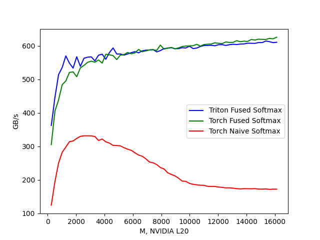

# Triton Fused Softmax
4x speedup vs naive_softmax, support multi-stages.

## Install

```bash
python3 -m pip install -r requirements.txt
```

## Benchmark

```bash
python3 triton_fused_softmax.py
```

performance plot (Higher GB/s is better)



sofmax performance data:

```bash
python3 triton_fused_softmax.py
NUM_SM: 92, NUM_REGS: 65536, SIZE_SMEM: 49152, WARP_SIZE: 32
softmax-performance: (GB/s)
          M  Triton Fused Softmax  Torch Fused Softmax  Torch Naive Softmax
0     256.0            362.393505           305.358765           124.678148
1     512.0            445.778519           405.032092           194.896749
2     768.0            514.098122           438.300277           250.346181
3    1024.0            535.408538           484.151615           282.482734
4    1280.0            569.918518           495.302961           298.126599
5    1536.0            548.277633           520.750543           314.245872
6    1792.0            533.588304           522.417207           316.189641
7    2048.0            567.566790           507.963708           323.995917
8    2304.0            538.947392           534.294155           330.039737
9    2560.0            563.100752           541.798988           331.690770
10   2816.0            566.233438           550.942414           331.748259
11   3072.0            567.218890           554.429254           331.566886
12   3328.0            555.099312           551.214055           329.411258
13   3584.0            572.163959           557.957312           317.685035
14   3840.0            575.175853           548.535608           322.132599
15   4096.0            559.898472           575.041421           313.671864
16   4352.0            580.166989           573.423500           309.974206
17   4608.0            593.755089           570.839527           302.986224
18   4864.0            575.728831           559.051306           302.688434
19   5120.0            575.766222           572.413610           301.564769
20   5376.0            572.423563           573.764541           296.201227
21   5632.0            575.843562           580.459896           291.670395
22   5888.0            579.751142           576.305867           288.366253
23   6144.0            582.716775           579.061272           281.005347
24   6400.0            579.270649           589.253228           274.376955
25   6656.0            585.002711           582.368493           270.766555
26   6912.0            587.171336           584.960726           263.143868
27   7168.0            587.587015           587.994311           253.358858
28   7424.0            589.017087           588.470371           251.164961
29   7680.0            581.928985           586.436541           245.850602
30   7936.0            585.914317           602.394388           236.971384
31   8192.0            591.928478           590.293530           232.782519
32   8448.0            593.058718           593.496120           221.579701
33   8704.0            594.695425           595.261556           216.494918
34   8960.0            591.452098           591.325040           212.167842
35   9216.0            591.788325           593.896863           205.272973
36   9472.0            594.511034           598.075544           196.612392
37   9728.0            593.693925           599.458087           195.754667
38   9984.0            598.928478           600.050556           189.836630
39  10240.0            591.822549           600.587319           186.929136
40  10496.0            593.427400           604.631795           185.559242
41  10752.0            598.165555           599.295332           184.250498
42  11008.0            600.996379           603.951158           183.771913
43  11264.0            601.199174           605.015824           180.982734
44  11520.0            601.669498           605.464543           180.641048
45  11776.0            600.274667           609.133846           180.645646
46  12032.0            603.406759           607.627874           178.938962
47  12288.0            603.722180           606.700927           177.688192
48  12544.0            601.190215           611.649160           176.379854
49  12800.0            603.581671           610.237343           176.527952
50  13056.0            604.757733           610.384488           175.390770
51  13312.0            603.985819           615.509130           174.097735
52  13568.0            605.297037           612.408629           173.256892
53  13824.0            605.908459           614.069065           174.128498
54  14080.0            607.920747           613.264977           173.922682
55  14336.0            607.635887           618.994853           173.581517
56  14592.0            607.396226           617.410641           174.207748
57  14848.0            609.851532           619.969111           172.837354
58  15104.0            609.737443           619.281199           172.619360
59  15360.0            614.387454           619.042827           173.398807
60  15616.0            612.544618           622.329807           171.825113
61  15872.0            609.665642           621.071773           172.623526
62  16128.0            610.741546           625.835582           172.361260
```

## PTX gen code
check [softmax_kernel.ptx](./softmax_kernel.ptx) for more details.

```NASM
// begin inline asm
    @%p2 cp.async.ca.shared.global [ %r82 + 0 ], [ %rd4 + 0 ], 0x4, %r34;
    // end inline asm
    selp.b32    %r36, %r45, 0, %p7;
    // begin inline asm
    @%p2 cp.async.ca.shared.global [ %r84 + 0 ], [ %rd5 + 0 ], 0x4, %r36;
    // end inline asm
    selp.b32    %r38, %r45, 0, %p8;
    // begin inline asm
    @%p2 cp.async.ca.shared.global [ %r86 + 0 ], [ %rd6 + 0 ], 0x4, %r38;
    // end inline asm
    selp.b32    %r40, %r45, 0, %p9;
    // begin inline asm
    @%p2 cp.async.ca.shared.global [ %r88 + 0 ], [ %rd7 + 0 ], 0x4, %r40;
    // end inline asm
    // begin inline asm
    cp.async.commit_group ;
    // end inline asm
    .loc    1 44 57                         // triton_fused_softmax.py:44:57
    @%p10 bra   $L__BB0_3;
// %bb.1:                               // %.lr.ph
    .loc    1 0 57                          // triton_fused_softmax.py:0:57
    ld.param.u32    %r28, [softmax_kernel_param_3];
    ld.param.u64    %rd2, [softmax_kernel_param_0];
    // begin inline asm
    mov.u32 %r32, %nctaid.x;
    // end inline asm
    cvt.u64.u32     %rd1, %r41;
    .loc    1 49 35                         // triton_fused_softmax.py:49:35
    and.b32     %r11, %r3, 31;
    sub.s32     %r12, %r29, %r32;
    add.s32     %r48, %r44, 4096;
    shr.u32     %r49, %r3, 3;
    and.b32     %r50, %r49, 28;
    add.s32     %r54, %r48, %r50;
    setp.lt.s32     %p15, %r3, 8;
    shl.b32     %r51, %r3, 2;
    add.s32     %r57, %r48, %r51;
    and.b32     %r52, %r3, 7;
    setp.eq.s32     %p13, %r52, 0;
    and.pred    %p16, %p15, %p13;
    .loc    1 44 57                         // triton_fused_softmax.py:44:57
    add.s32     %r53, %r131, %r32;
    mul.lo.s32  %r129, %r27, %r53;
    mul.lo.s32  %r16, %r32, %r27;
    mul.lo.s32  %r128, %r131, %r28;
    mul.lo.s32  %r18, %r32, %r28;
    mov.b32     %r130, -1;
$L__BB0_2:                              // =>This Inner Loop Header: Depth=1
    .loc    1 0 57                          // triton_fused_softmax.py:0:57
    cvt.u32.u64     %r90, %rd1;
    setp.eq.s32     %p14, %r11, 0;
    .loc    1 52 29                         // triton_fused_softmax.py:52:29
    setp.lt.s32     %p20, %r90, %r30;
    .loc    1 44 57                         // triton_fused_softmax.py:44:57
    setp.lt.s32     %p28, %r131, %r12;
    add.s32     %r91, %r130, 1;
    setp.gt.u32     %p29, %r130, 2147483646;
    selp.b32    %r130, %r91, 0, %p29;
    .loc    1 53 22                         // triton_fused_softmax.py:53:22
    // begin inline asm
    cp.async.wait_group 0x0;
```
